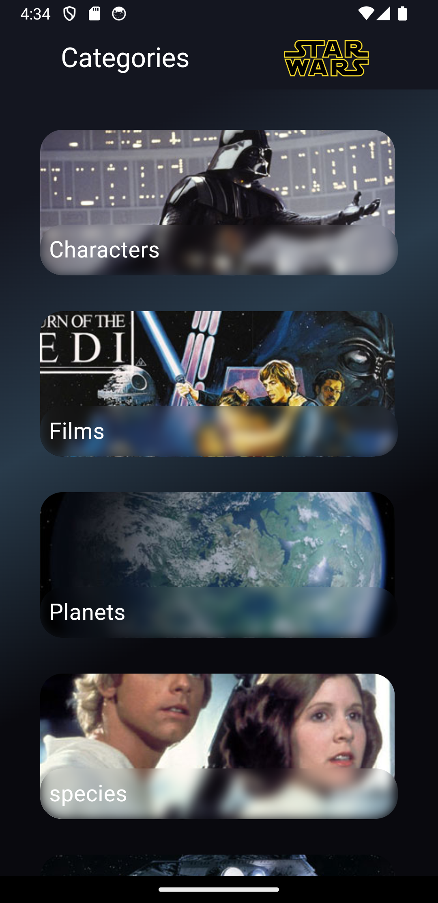
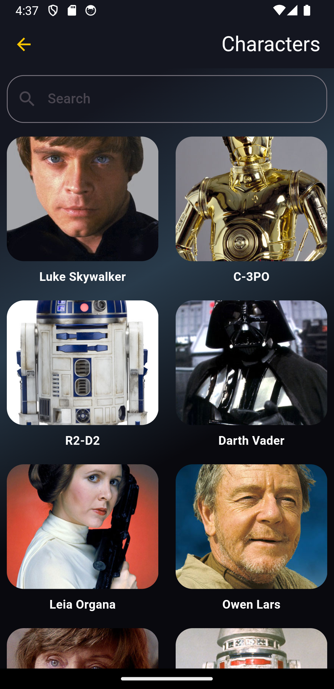

# Star Wars App

### Aplicativo desenvolvido em Flutter consumindo a API do Star Wars

Este aplicativo permite aos usuários explorar informações sobre personagens, naves espaciais, planetas e muito mais do universo de Star Wars. Ele foi desenvolvido usando a [Star Wars API (SWAPI)](https://swapi.dev/) para buscar e exibir os dados da saga.

## Funcionalidades

- **Catálogo de Personagens**: Exibe uma lista de personagens com detalhes como nome, espécie, e planeta de origem.
- **Naves Espaciais**: Mostra informações sobre naves como modelo, fabricante e capacidade.
- **Planetas**: Lista os planetas do universo Star Wars com dados sobre clima, terreno e população.

## Arquitetura

Este projeto segue a **Clean Architecture** e o padrão de design **MVC (Model-View-Controller)**, garantindo a separação de responsabilidades, escalabilidade e manutenção eficiente.

- **Domain**: Contém as entidades.
- **Data**: Implementa os datasources e faz a comunicação com a API SWAPI.
- **Presentation**: Camada responsável pela UI e lógica de apresentação.
- **Core**: Configura a injeção de dependências e utilidades compartilhadas.

## Tecnologias Utilizadas

- **Flutter**: Framework para desenvolvimento multiplataforma (Android/iOS).
- **Clean Architecture**: Estrutura modular para facilitar a manutenção e escalabilidade.
- **MVC Design Pattern**: Separação da lógica de negócios, visualização e controle.
- **API RESTful (SWAPI)**: Fonte de dados sobre o universo Star Wars.

## Como Rodar o Projeto

Siga os passos abaixo para rodar o aplicativo localmente:

1. **Clone o repositório:**

   ```bash
   git clone https://github.com/RafaellaBarbosa/star_wars_app.git
   ```

2. **Instale as dependências:**

   No diretório do projeto, execute:

   ```bash
   flutter pub get
   ```

3. **Execute o projeto:**

   Para rodar o aplicativo no seu dispositivo/emulador:

   ```bash
   flutter run
   ```

4. **Configuração de API (opcional):**

   O aplicativo utiliza a SWAPI como API pública, então não é necessário configurar nenhuma chave de API.

## Capturas de Tela


*Exemplo de listagem de personagens*


*Tela de detalhes de um personagem*

## Melhorias Futuras

- Implementação de favoritos para salvar personagens e naves preferidas.
- Integração com banco de dados local para funcionalidade offline.
- Animações e transições visuais mais dinâmicas.
- Permitir aos usuários buscar de personagens, naves ou planetas específicos.
